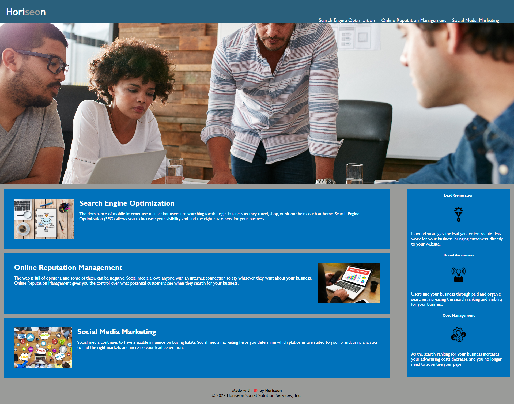

# Challenge1-Horiseon

## Description

The aim of this project was to adjust the website to better meet accessibility standards, optimise it for search engine visability and adjust the code to be better structured. 
During the process I was able to adjust the HTML code with Semantic Elements which reduced the amount of code in the HTML file. 
I was also able to adjust the colour of certain sections to make it better visable for any vision impaired users.

This project has assisted with my understanding of HTML Semantic Elements and some basic CSS. It has also highlighted that I need more revision.

## Usage

The link to access the website and a screenshot of the finished page is below...

Provide instructions and examples for use. Include screenshots as needed.

To add a screenshot, create an `assets/images` folder in your repository and upload your screenshot to it. Then, using the relative file path, add it to your README using the following syntax:

